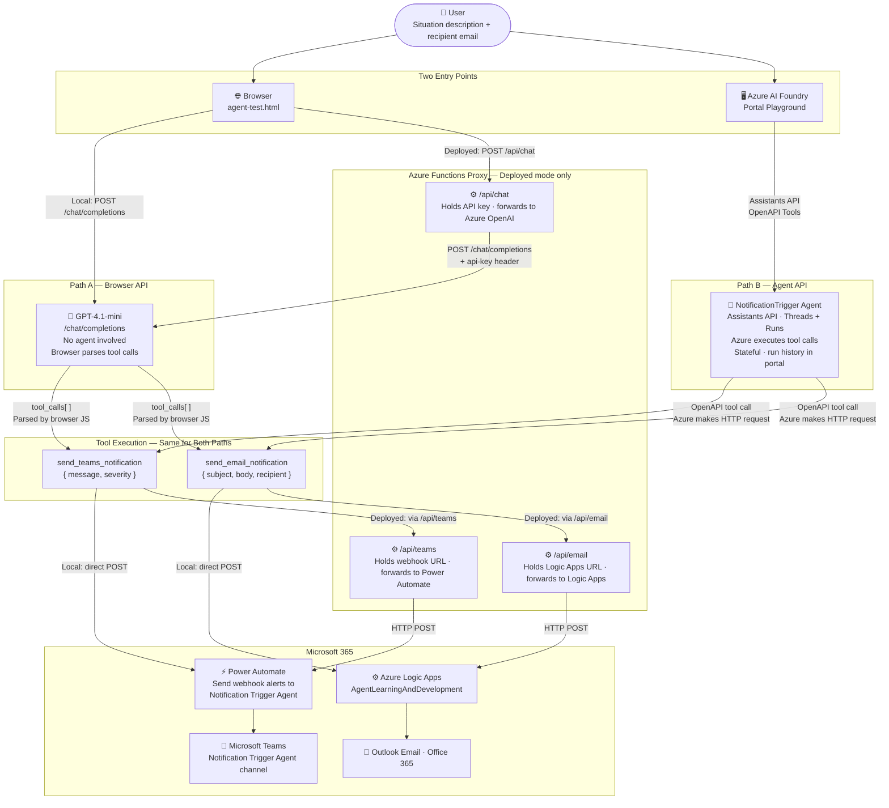

# Architecture

## System Overview

This project implements the same notification capability via **two distinct execution paths.** Both deliver to the same channels. The difference is which Azure API is used and who executes the tool calls.



---

## Components

| Component | Path | Role | Technology |
|---|---|---|---|
| `agent-test.html` | A | Browser UI — input form, live log panel, tool execution loop | Vanilla JS, HTML/CSS |
| `index.html` | A (deployed) | Entry point redirect required by Azure Static Web Apps | HTML |
| `config.js` | A (local) | Local credential store (gitignored) | JavaScript |
| `staticwebapp.config.json` | A (deployed) | SWA routing config — serves agent-test.html at `/`, security headers | Azure Static Web Apps |
| Azure OpenAI `/chat/completions` | A | LLM inference with function calling — no agent involved | Azure OpenAI API |
| Browser JavaScript (`runAgent()`) | A | Calls `/chat/completions` (local) or `/api/chat` (deployed), parses `tool_calls` | Vanilla JS |
| `/api/chat` Azure Function | A (deployed) | Proxy — holds API key server-side, forwards to Azure OpenAI | Azure Functions (Node.js 18) |
| `/api/teams` Azure Function | A (deployed) | Proxy — holds Power Automate webhook URL server-side | Azure Functions (Node.js 18) |
| `/api/email` Azure Function | A (deployed) | Proxy — holds Logic Apps URL server-side | Azure Functions (Node.js 18) |
| NotificationTrigger Agent | B | Hosted agent — analyses situation, decides severity, calls OpenAPI tools | Azure AI Agents (Assistants API) |
| OpenAPI Tool Definitions | B | Describe Teams webhook + Logic Apps endpoints; Azure makes the HTTP calls | Azure AI Foundry Tools |
| Power Automate Flow | A + B | Receives webhook payload, posts message to Teams channel | Microsoft Power Automate |
| Azure Logic Apps | A + B | Receives HTTP trigger, sends Outlook email via Office 365 connector | Azure Logic Apps (Consumption) |
| Microsoft Teams | A + B | Alert destination — Notification Trigger Agent channel | Microsoft Teams (Workflows bot) |
| Outlook / Office 365 | A + B | Email destination | Office 365 Outlook |

---

## Data Flow

### Path A — Browser (agent-test.html)

```
1. User types situation + recipient email → clicks Run Agent
2. Browser POSTs to Azure OpenAI /chat/completions with:
   - System prompt (agent instructions + consistency rule)
   - User message (situation + recipient)
   - Tool definitions for send_teams_notification + send_email_notification
3. GPT-4.1-mini returns tool_calls[] in the response
4. Browser JavaScript parses tool_calls
5. For send_teams_notification → Browser POSTs { message, severity } to Power Automate webhook
6. For send_email_notification → Browser POSTs { subject, body, recipient } to Logic Apps URL
7. Power Automate posts message to Teams channel
8. Logic Apps sends email via Office 365 Outlook connector
9. Live log panel updates at each step
```

### Path B — Azure AI Foundry Portal

```
1. User types situation + recipient email in Foundry playground chat
2. NotificationTrigger agent (Assistants API) processes the message
3. Agent calls send_teams_notification OpenAPI tool → Azure makes HTTP call to Power Automate
4. Agent calls send_email_notification OpenAPI tool → Azure makes HTTP call to Logic Apps
5. Power Automate posts message to Teams channel
6. Logic Apps sends email via Office 365 Outlook connector
7. Agent confirms actions in the chat response
```

### Key Difference Between Paths

| | Path A (Browser) | Path B (Foundry Portal) |
|---|---|---|
| Who executes tool calls | Browser JavaScript | Azure (server-side) |
| API used | `/chat/completions` | Assistants API (threads + runs) |
| State | Stateless — no history | Stateful — thread history preserved |
| Run history visible in Foundry | No | Yes |

---

## Infrastructure

| Resource | Name | Region | Plan |
|---|---|---|---|
| Azure AI Foundry Project | l-and-d-02 | East US | — |
| Model Deployment | gpt-4.1-mini | East US | Standard Global |
| Azure Logic Apps | AgentLearningAndDevelopment | East US | Consumption |
| Power Automate Flow | Send webhook alerts to Notification Trigger Agent | Default environment | — |
| Teams Channel | Notification Trigger Agent | — | Microsoft 365 |

---

## Key Design Decisions

### 1. Two independent interfaces
The browser HTML file and the Foundry portal both work standalone. The HTML uses the raw chat completions API — no npm dependencies or build step when running locally. When deployed on Azure Static Web Apps, credentials are held server-side via an Azure Functions proxy; the HTML itself is unchanged. The Foundry portal uses the full Assistants API with stateful threads. This allows a quick local test interface, a publicly hosted live demo, and a production-grade agent with audit trail — all from the same codebase.

### 2. OpenAPI tools in Foundry (not custom function definitions)
Azure AI Foundry's Agents UI supports OpenAPI tool definitions — the agent calls external HTTP endpoints directly from Azure. This means no client-side code is needed when using the portal; Azure itself makes the HTTP calls to Power Automate and Logic Apps.

### 3. Auth via URL-embedded SAS tokens
Both the Teams webhook (Power Automate) and email endpoint (Logic Apps) use SAS tokens embedded in the URL. No separate auth header is required. Tokens expire — regenerate from Power Automate flow trigger and Logic App designer when they do.

### 4. Consistency constraint in system prompt
Initial versions produced divergent content across Teams and email (different phrasing, sometimes different severity). Root cause: the model generated both outputs independently. Fixed by adding an explicit rule: *"Decide on the facts and severity ONCE, then express them in each format."*
