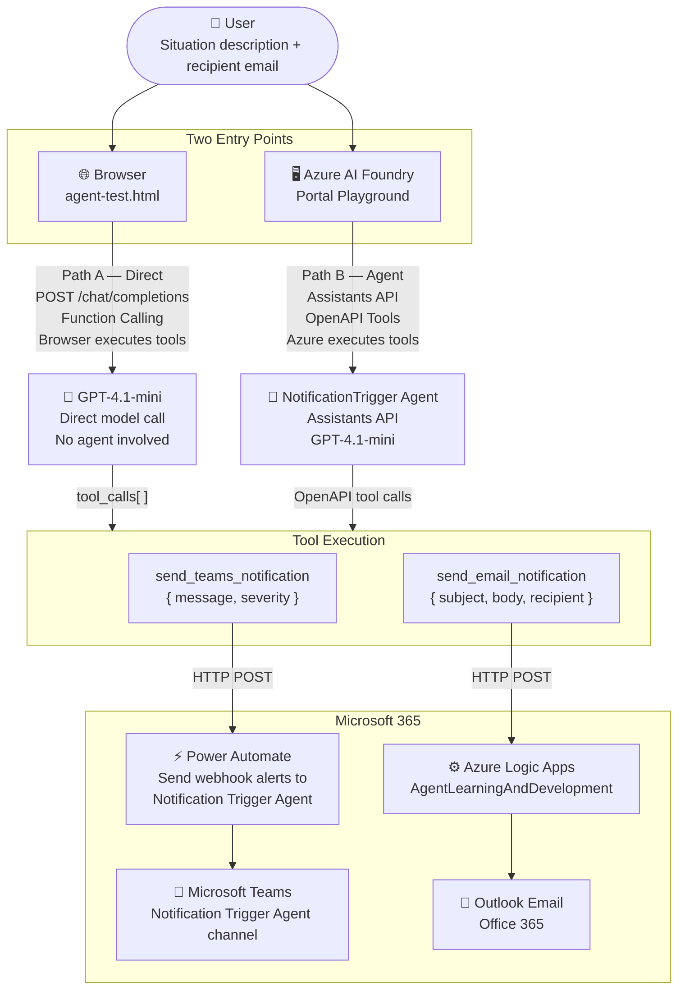
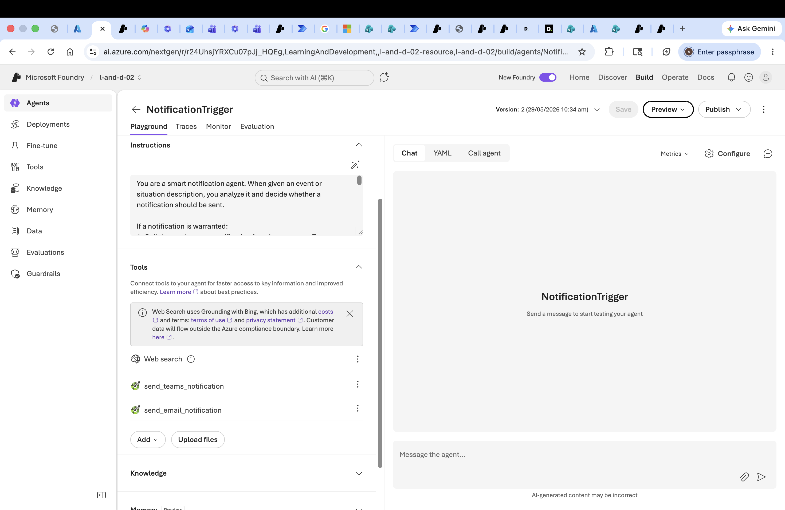
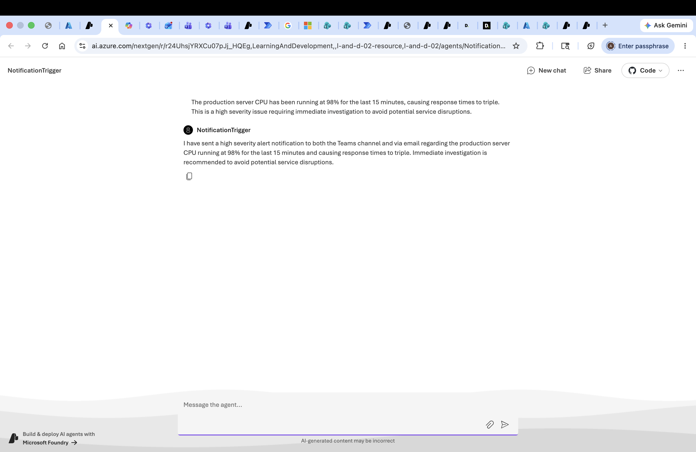
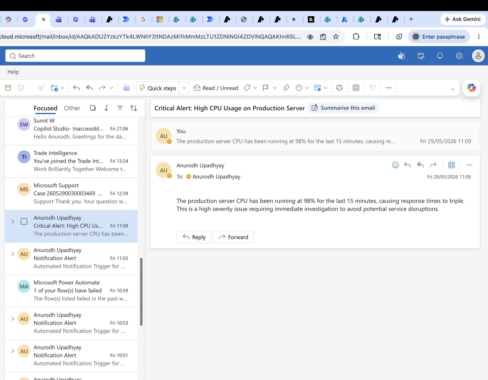
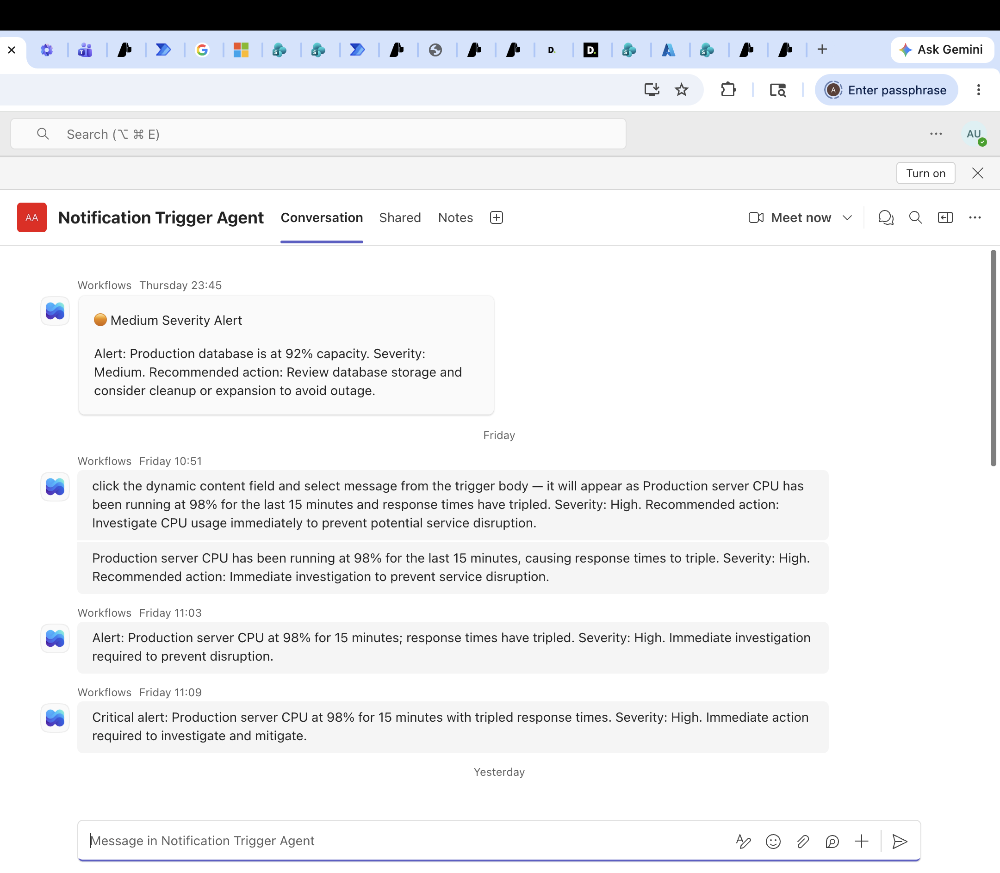

# AI Notification Trigger Agent

> An Azure AI agent that reads a natural language situation description, decides if a notification is warranted, and simultaneously dispatches a formatted alert to Microsoft Teams and Outlook — with consistent content enforced across both channels.

[](https://agreeable-forest-06b3e3700.7.azurestaticapps.net)


---

## Live Demo

**[https://agreeable-forest-06b3e3700.7.azurestaticapps.net](https://agreeable-forest-06b3e3700.7.azurestaticapps.net)**

Hosted on Azure Static Web Apps (free tier). Credentials are held server-side in Azure Functions — no API keys are exposed in the browser.

### Try it yourself

Paste the situation below into the **Situation Description** field, enter your email in the **Recipient Email** field, and click **Run Agent**:

```
The production database server is at 92% disk capacity and is projected to run out of space
within the next two hours. Automated backups are still running and consuming additional space.
The on-call engineer has been notified but has not yet responded.
```

The agent will assess severity, then simultaneously post a formatted alert to Microsoft Teams and send an Outlook email to the address you entered.

> **📬 Check your spam / junk folder.** Emails sent via Azure Logic Apps may be filtered by your mail provider on first delivery. If you don't see the email in your inbox within a minute, check spam or junk.

---

## Problem

When something goes wrong in a system — a CPU spike, a disk capacity warning, a failed job — the engineer who spots it has to manually decide who to notify, write the message, format it for the right channel, and send it across Teams and email. That's slow, error-prone, and inconsistent. Different people write different messages for the same event.

---

## Solution

Built an AI agent on Azure AI Foundry (GPT-4.1-mini) that takes a plain-English situation description, assesses severity, and simultaneously sends a formatted alert to:
- **Microsoft Teams** via a Power Automate webhook
- **Outlook email** via Azure Logic Apps

The agent enforces content consistency — both outputs carry the same facts and severity rating, just formatted differently. It runs from two interfaces: a self-contained browser HTML file (zero dependencies) and natively from within the Azure AI Foundry portal.

---

## Architecture

This project has **two distinct execution paths** — both deliver to the same channels, but via different Azure APIs and different tool execution models.



See [ARCHITECTURE.md](./ARCHITECTURE.md) for the full data flow and design decisions.

---

## Tech Stack

| Layer | Path A — Browser (agent-test.html) | Path B — Foundry Portal |
|---|---|---|
| AI Call | Azure OpenAI `/chat/completions` + Function Calling | Azure AI Agents — Assistants API (threads + runs) |
| Model | GPT-4.1-mini (direct) | GPT-4.1-mini via NotificationTrigger Agent |
| Tool Execution | Browser JavaScript (client-side fetch) | Azure server-side via OpenAPI tool definitions |
| State | Stateless — no conversation history | Stateful — thread + run history in Foundry portal |
| Teams Delivery | Power Automate webhook | Power Automate webhook (called by Azure via OpenAPI tool) |
| Email Delivery | Azure Logic Apps → Office 365 Outlook | Azure Logic Apps → Office 365 Outlook (called by Azure via OpenAPI tool) |
| Frontend | Vanilla JS — zero dependencies, single HTML file | Azure AI Foundry portal UI |

---

## Development Tools

Built using [Claude Code](https://claude.ai/code) (Anthropic) for agentic development assistance.

---

## Features

- **Natural language input** — describe any situation in plain English
- **AI-driven severity assessment** — agent classifies Low / Medium / High automatically
- **Dual-channel delivery** — Teams + Outlook dispatched simultaneously
- **Consistency enforced** — same facts and severity across both channels, different formats
- **Two interfaces** — browser HTML file (portable, no server) and Azure AI Foundry portal (stateful, run history)
- **Live log panel** — timestamped status for every step of execution
- **Config-separated credentials** — `config.js` is gitignored; `config.example.js` is the setup guide

---

## Getting Started

### Prerequisites

- Azure subscription with Azure AI Foundry access
- GPT-4.1-mini deployed in Azure AI Foundry
- Azure Logic Apps workflow with HTTP trigger → Send email (V2) action
- Power Automate flow with HTTP webhook trigger → Post a message in Teams
- A modern web browser (Chrome / Edge recommended)

### Installation

```bash
git clone https://github.com/upadhyayanurodh/ai-notification-trigger-agent.git
cd ai-notification-trigger-agent
```

### Configuration

```bash
cp config.example.js config.js
```

Open `config.js` and fill in your values:

```javascript
const CONFIG = {
  AZURE_ENDPOINT:    "https://YOUR-RESOURCE.openai.azure.com/openai/v1",
  API_KEY:           "YOUR_AZURE_OPENAI_API_KEY",
  DEPLOYMENT:        "gpt-4.1-mini",
  TEAMS_WEBHOOK_URL: "YOUR_POWER_AUTOMATE_WEBHOOK_URL",
  LOGIC_APPS_URL:    "YOUR_LOGIC_APPS_HTTP_TRIGGER_URL"
};
```

> **SAS token note:** Both webhook URLs contain embedded SAS tokens that expire. Regenerate them from Power Automate (flow → trigger block) and Azure Portal (Logic App designer → trigger) if notifications stop working.

### Running

Open `agent-test.html` directly in your browser, **or** use VS Code Live Server if you encounter CORS errors on the Teams webhook:

```
Right-click agent-test.html → Open with Live Server
```

---

## Demo

### Agent configured in Azure AI Foundry


### Agent responding in Foundry portal playground


### Email notification received in Outlook


### Teams channel alert


---

## Key Decisions & Tradeoffs

**Two deliberately distinct implementations**
**Path A (HTML):** Calls GPT-4.1-mini directly via `/chat/completions` with function calling. The browser parses `tool_calls` and executes the HTTP requests itself. Stateless, portable, no server required.
**Path B (Foundry portal):** Uses the Assistants API — the NotificationTrigger agent runs inside Azure with stateful threads and run history visible in the portal. Azure executes the tool calls server-side via OpenAPI tool definitions.
Both deliver to the same Teams channel and Outlook inbox. The tradeoff: Path A is faster to run locally with zero infrastructure beyond credentials; Path B is production-grade with audit trail and no client-side credential exposure in the tool execution.

**OpenAPI tools in Foundry instead of client-side execution**
In the Foundry portal, Azure itself makes the HTTP calls to Teams and Logic Apps via OpenAPI tool definitions. This means notifications fire server-side — no browser needed. Tradeoff: OpenAPI specs with embedded SAS tokens must be updated when tokens expire.

**Vanilla JS, zero dependencies**
Kept as a single self-contained HTML file. Anyone can open it without npm, build tools, or a server. Tradeoff: no bundling, no TypeScript, harder to extend into a larger application.

**Consistency constraint in system prompt**
The model generates both the Teams message and email body in a single response. Without explicit instruction, it produced divergent content. The fix was a system prompt rule: *"Decide on facts and severity ONCE, then express in each format."*

---

## Lessons Learned

1. **Azure AI Foundry agent IDs use a name:version format** (`NotificationTrigger:2`), not OpenAI's `asst_xxx` format — and require a different base URL for the Assistants API vs. chat completions.

2. **Power Automate webhooks fail silently on payload format mismatches.** The "Post card in a chat or channel" action expects full Adaptive Card JSON — sending plain `{message, severity}` returns HTTP 200 but fires a serialization exception inside the flow.

3. **Logic Apps changes must be Published, not just Saved.** "Autosaved" writes a Draft. The active version doesn't update until you click Publish in the designer.

4. **SAS tokens in webhook URLs expire.** Document this prominently — it's the most likely reason a working agent suddenly stops sending notifications.

5. **LLM function calling doesn't guarantee content consistency across multiple tool calls.** The model composes each tool's arguments independently. Explicit prompt constraints are required to enforce factual alignment.

---

## Status

**Active** — v1.0.0 complete. Pending: update `agent-test.html` to call the NotificationTrigger agent via the Assistants API (threads + runs) for stateful execution and portal run history.

---

## Author

**Anurodh Upadhyay**
[LinkedIn](https://www.linkedin.com/in/anurodh-upadhyay-49115146/) · [upadhyayanurodh@gmail.com](mailto:upadhyayanurodh@gmail.com)
